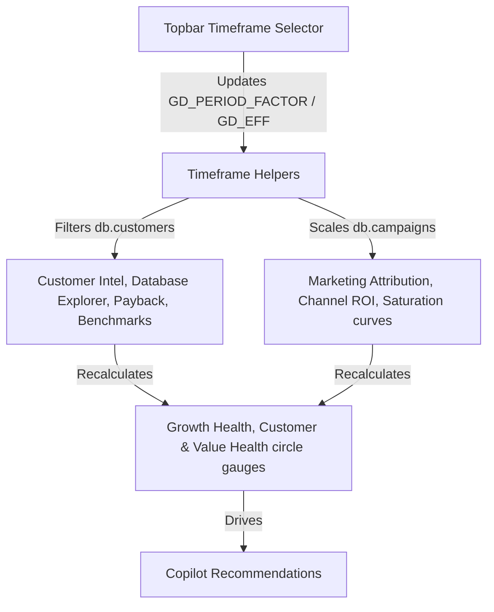

# Data Flow & Database Integration Guide

This guide details the complete data maps, database structures, computation formulas, component dependencies, and timeframe synchronization mechanisms of the **Growth Operating System (GOS)**.

---

## 1. Core Data Models & Schema Requirements

The system runs on two primary active datasets: a transactional customer log (`db.customers`) and an aggregated performance marketing table (`db.campaigns`).

### 1.1 Customer Database (`db.customers`)
Represents the primary user ledger. Used for attribution, lifetime value (LTV) models, cohort calculations, and health metrics.

| Field Name | Type | Description / Valid Values |
| :--- | :--- | :--- |
| `Customer_ID` | String | Unique customer identifier, format: `CUST-XXXX`. |
| `Install_Date` | String | App installation date, format: `YYYY-MM-DD`. |
| `KYC_Date` | String | Date KYC verification was completed, or `"None"`. |
| `FTD_Date` | String | Date of First Time Deposit, or `"None"`. |
| `Country` | String | Registered country (e.g. `Vietnam`, `Thailand`, `Indonesia`, `Singapore`, `Philippines`). |
| `Device` | String | Platform device type: `iOS` or `Android`. |
| `Source` | String | Acquisition channel: `Meta Ads`, `Google Ads`, `TikTok Ads`, `Apple Search Ads`, or `Organic`. |
| `Campaign` | String | Campaign identifier or `"None"`. |
| `Revenue` | Number | Realized cumulative revenue generated by the user in USD. |
| `Deposit` | Number | Cumulative deposits made by the user in USD. |
| `FTD_Volume` | Number | Value of the user's very first deposit in USD. |
| `TradeVolume` | Number | Total cumulative trade volume processed in USD. |
| `Trade_Count` | Integer | Total number of executed trades. |
| `LTV` | Number | Estimated customer lifetime value in USD. |
| `Whale_Flag` | String | `"Yes"` if deposit value $\ge \$5,000$, else `"No"`. |
| `Segment` | String | User value segment: `Whale`, `Core`, `Casual`, `Dormant`, or `New User`. |
| `Retention_Status` | String | Churn classification: `Active`, `At Risk`, or `Churned`. |
| `Onboarding_Step_Drop` | String | Last completed step for incomplete funnels (e.g. `Install`, `Register`, `KYC_Initiated`, `KYC_Submitted`, `FTD_Pending`, or `None` if fully converted). |
| `InteractionsToKyc` | Integer | Number of session/content interactions prior to KYC submission. |
| `InteractionsToFtd` | Integer | Number of session/content interactions prior to first deposit. |
| `AssetsViewed` | Integer | Total app pages/screens viewed. |
| `VideosWatched` | Integer | Total video creatives watched in the app. |
| `WatchTime` | Number | Total watch duration in minutes. |
| `SessionFrequency` | Integer | Average session count per week. |

### 1.2 Campaign Performance Table (`db.campaigns`)
Stores aggregations of performance marketing metrics by channel and campaign.

| Field Name | Type | Description |
| :--- | :--- | :--- |
| `Campaign_ID` | String | Campaign identifier matching user campaigns (e.g., `M-01`, `G-02`). |
| `Channel` | String | Marketing channel (e.g., `Meta Ads`, `Google Ads`, `TikTok Ads`, `Apple Search Ads`). |
| `Spend` | Number | Total ad spend in USD. |
| `Impression` | Integer | Total creative impressions. |
| `Click` | Integer | Total clicks. |
| `Install` | Integer | Conversions from click to app install. |
| `KYC` | Integer | Conversions from install to completed KYC. |
| `Revenue` | Number | Cumulative revenue driven in USD. |

---

## 2. Key Computation Formulas

The system synchronizes all sub-systems using the following formulas:

### 2.1 Growth Health Score Breakdown
The main growth health indicator is computed as a weighted average of 5 core dimension scores (clamped between 5% and 100%):
$$\text{Growth Health} = S_{\text{Growth}} \times W_{\text{growth}} + S_{\text{Profit}} \times W_{\text{profit}} + S_{\text{Ret}} \times W_{\text{ret}} + S_{\text{CapEff}} \times W_{\text{capeff}} + S_{\text{Risk}} \times W_{\text{risk}}$$

1. **Growth Score ($S_{\text{Growth}}$)**: Compares daily revenue of the second half ($R_2$) vs the first half ($R_1$) of the selected period:
   $$S_{\text{Growth}} = 65 + \left(\frac{\text{Avg}(R_2) - \text{Avg}(R_1)}{\text{Avg}(R_1)}\right) \times 220$$
2. **Profitability Score ($S_{\text{Profit}}$)**: Compares blended LTV:CAC against target benchmarks:
   $$S_{\text{Profit}} = \left( \frac{\text{Blended LTV/CAC}}{\text{Target LTV/CAC Benchmark}} \right) \times 85$$
3. **Retention Score ($S_{\text{Ret}}$)**: Scaled from the latest cohort's D30 retention percentage:
   $$S_{\text{Ret}} = \left( \frac{\text{D30 Retention \%}}{25\%} \right) \times 100$$
4. **Capital Efficiency Score ($S_{\text{CapEff}}$)**: Penalty based on the average customer payback period in months:
   $$S_{\text{CapEff}} = 115 - \text{Avg}(\text{Payback Months}) \times 11$$
5. **Risk Score ($S_{\text{Risk}}$)**: Penalty if Whale concentration exceeds target threshold limits:
   $$S_{\text{Risk}} = 100 - \max\left(0, \text{Whale Rev Concentration \%} - (\text{Whale Limit} - 10\%)\right) \times 2.5$$

### 2.2 Segment Health Gauges
- **Customer Health Circle**: Determines the vitality of the customer base based on churn states:
  $$\text{Customer Health} = \frac{\text{Active Customers} + 0.5 \times \text{At Risk Customers}}{\text{Total Customers in Timeframe}} \times 100$$
- **Value Health Circle**: Determines the capital conversion capability of deposits to revenue:
  $$\text{Value Health} = \frac{\text{Cumulative Revenue}}{\text{Cumulative Deposit}} \times 100 \quad (\text{Clamped to max 100\%})$$

### 2.3 Product Virality ($K$-Factor)
Tracks user referral efficiency:
$$K\text{-Factor} = \text{Referral Invite Rate} \times \text{Avg}(\text{Loop Conversion Rates}) \times \text{Virality Boost Factor}$$

---

## 3. Timeframe Synchronization & Data Flows

When the user modifies the timeframe selector (7d, 30d, 90d, 180d, 365d), the system applies two synchronization patterns:

### 3.1 Timeframe Filtering (Customer-based Grids)
For grids relying directly on individual customers (`db.customers`), GOS filters them using the installation date helper:
$$\text{Cutoff Date} = \text{Today} - \text{Timeframe Days}$$
$$\text{Customers}_{\text{filtered}} = \{ c \in \text{db.customers} \mid c.\text{Install\_Date} \ge \text{Cutoff Date} \}$$

This filter is applied live to:
- **Customer Intel Tab** (Segment distribution charts, event stream).
- **Database Explorer** (Net LTV, incentive expense, database grids).
- **Payback Periods Grid** (Channel payback speeds).
- **Benchmarks** (Live performance vs industry standard targets).
- **Attribution Matrix** (Multi-touch models: first, last, linear, decay, position, data-driven).

### 3.2 Timeframe Scaling (Campaign-based Grids)
Since performance campaigns represent aggregate records, timeframe scaling adapts totals using a period multiplier:
$$\text{GD\_PERIOD\_FACTOR} = \frac{\text{Selected Timeframe Days}}{30 \text{ days}}$$
$$\text{Spend}_{\text{scaled}} = \text{Spend}_{\text{base}} \times \text{GD\_PERIOD\_FACTOR}$$
$$\text{Revenue}_{\text{scaled}} = \text{Revenue}_{\text{base}} \times \text{GD\_PERIOD\_FACTOR} \times \text{GD\_EFF}$$

---

## 4. Component Dependencies & Input Rules

### 4.1 Required Configurations for Accurate GOS Outputs:
1. **Regime Selections**: Economic scenarios (Regime multi-touch adjusters) directly scale LTV calculations via `retMul` and `cacMul` factors.
2. **Channel Benchmarks**: Benchmarks (Target LTV:CAC, Target CVR) must be updated in Tab 6 configuration lists whenever channel portfolios change.
3. **Weight Adjustments**: Weight configs in Tab 6 must sum to exactly $1.00$ ($100\%$) to maintain mathematical consistency in the blended Growth Health gauge.
